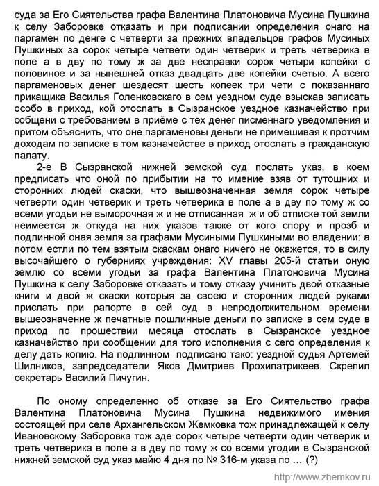

# KEKTEXT

## Использование модели распознавателя текста.

Для использования модели распознавателя текста необходимо сначала установить
зависимости с помощью следующих команд:

    sudo apt install tesseract-ocr
    sudo apt install libtesseract-dev
    pip install -r reuirements.txt
    
Пример использования распознавателя текста можно посмотреть в файле _inference.py_

Для входного изображения

скрипт _inference.py__ вернет следующий текст

    суда за Его Сиятельства графа Валентина Платонович Мусина Пушкина
    к селу Заборовке отказать и при подписании определения онаго на
    паргамен по денге с четверти за прежних владельцов графов Мусиных
    Пушкиных за сорок четыре четвети один четверик и треть четверика в
    поле а в дву по тому ж за две несправки сорок четыри копейки с
    половиное и за нынешней отказ двадцать две копейки счетью. А всего
    паргаменовых денег шездесят шесть копеек три чети с показаннаго
    прикащика Василья Голенковскаго в сем уездном суде взыскав записать
    0с0бо в приход, кой отослать в Сызранское уездное казначейство при
    собщени с требованием в приёме с тех денег писменнаго уведомления и
    притом объяснить, что оне паргаменовы деньги не примешивая к протчим
    доходам по записке в том казначействе в приход отослать в гражданскую
    палату.
    
    2-е В Сызранской нижней земской суд послать указ, в коем
    предписать что оной по прибытии на то имение взяв от тутошних и
    сторонних людей скаски, что вышеозначенная земля сорок четыре
    четверти один четверик и треть четверика в поле а в дву по тому ж со
    всеми угодьи не выморочная ж и не отписанная жи об отписке той земли
    неимеется ж откуда на них указов также от кого спору и прозб и
    подлинной оная земля за графами Мусиными Пушкиными во владении: а
    потом естли по тем взятым скаскам онаго ничего не окажется, то в силу
    высочайшего о губерниях учреждения: ХМ главы 205-й статьи оную
    землю со всеми угодьи за графа Валентина Платоновича Мусина
    Пушкина к селу Заборовке отказать и тому отказу учинить двой отказные
    книги и двой ж скаски которыя за своею и сторонних людей руками
    прислать при рапорте в сей суд в непродолжительном времени
    вышеозначенне ж печатные пошлинные деньги по записке в сем суде в
    приход по прошествии месяца отослать в Сызранское уездное
    казначейство при сообщении для того исполнения с сего определения к
    делу дать копию. На подлинном подписано тако: уездной судья Артемей
    Шилников, запредседатели Яков Дмитриев Прохипатрикеев. Скрепил
    ‘секретарь Василий Пичугин.
    
    По оному определенно об отказе за Его Сиятельство графа
    Валентина Платоновича Мусина Пушкина недвижимого имения
    состоящей при селе Архангельском Жемковка тож принадлежащей к селу
    Ивановскому Заборовка тож зде сорок четыре четверти один четверик и
    треть четверика в поле а в дву по тому ж со всеми угодии в Сызранской
    нижней земской суд указ майю 4 дня по № 316-м указа по... (?)
    
    'Ир:/Аммлм.петкомги

